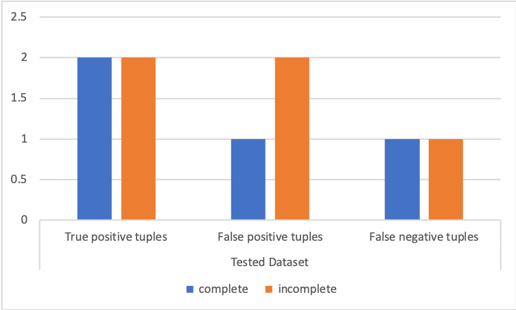

# Quality Metrics 

Compare a dataset with a ground-truth dataset and compute:

__At attribute (cell) level:__
* A true positive is a correct  non-null output value.
* A true negative is a correctly output null, i.e., it was expected to be null in the ground truth.
* A false negative is a missing output value (a null).
* A false positive is a non-null incorrect output value.

__At tuple (row) level:__
Given that a tuple typically has several attribute values, the correctness of the tuple is computed based on the dominant correctness label among the labels for its attribute values.
* A \textit{true positive} is an output tuple where all or most of its attribute values are correct, i.e., a \textit{TP} or a \textit{TN} at the attribute level.
* A \textit{false positive} is an output tuple where all or most of its attribute values are not nulls, but incorrect, i.e., not as expected in the ground truth.
* A \textit{false negative} is an output tuple where all or most of its values are missing, i.e., are nulls. 
* True negatives} -- We do not measure the true negative tuples as these would represent the number of correctly eliminated tuples and this is not the focus of the evaluation.

__Level of completeness of tuples.__
The correctness of a tuple is determined by using the dominant correctness in its attribute values, so we say that a tuple is \textit{complete} if all its attribute values have the same type of correctness label, and \textit{incomplete} if they are mixed.

## Installation Requirements

The project uses java 8 and SQL (Postgres). 

## Input Files

* _input CSV file_ : The input CSV file should contain 4 columns: 
                    1. the __database name__ in postgres (local db)
                    2. the filepath to the SQL script that runs a query to compute the *ground truth* dataset
                    3. the filepath to the SQL script that runs a query that computes the *tested* dataset
                    3. the name of the column that should be considere as (pseudo) key. If a (primary/candidate) key is not present, then here should be stated the column that is expected to be the most diverse, i.e., with the largest number of distinct values.
Note:

- The input CSV file can contain multiple lines if multiple datasets need to be tested in the same run. 
- The SQL files can be any SQL script that is valid on a postgres database: can contain selection, aggregators, joins operators etc.

* _output CSV file_ : The filepath to the desired output CSV file.

## Output Files

* The above mentioned _output_ file will contain the CSV data. The CSV data entails 18 columns:
        1. MAPPING FILENAME: contains the name of the SQL file that was run to obtain the __test__  datasets.
        2. Mapping cardinality: the size of the __test__  dataset on that line.
        3. TL - Precision: tuple level precision.
        4. TL - Recall: tuple level recall.
        5. TL - F-measure: tuple level F-measure.
        6. TL - true positives: total number of true positives - tuple level.
        7. TL - False positives: total number of false positives - tuple level.	 
        8. TL - False negatives: total number of false negatives - tuple level.	 
        9. TL - incomplete TPs: tuple level incomplete true positives. Implicitly, the number of *full* true positive tuples, i.e., with all values as in the ground truth = the value in col #6 - #9.	 
        10. TL - incomplete FPs: tuple level incomplete false positives. Implicitly, the number of *full* false positive tuples, i.e., with all values different from the ground truth = the value in col #7 - #10.	 	 
        11. TL - incomplete FNs: tuple level incomplete false negatives. Implicitly, the number of *full* false negative tuples, i.e., with all values missing = the value in col #8 - #11.	
        12->18. The same examplantion as in 3->8 but at attribute (cell) level. 	 
* Another file is produced with the name __output_file_name_plot.csv__ where it is easy to select the produced data so as to compute a plot such as the one bellow.

## Running the App

* The app can be run from either an IDE or a terminal. Currently, it doesn't take as arguments the two mentioned input files (to be done). They need to be set in the main method in __src/quality/GenerateMetrics__. 
An example scenario can be found in __resources/unit_test__. The main() method is already setup for this test.

## Test files 

* In __resources/unit_test__ there is a small test to populate a small database and test the app:
        1. __input.csv__ - the input file (expected in the input)
        2. __ground_truth.sql__ - the SQL that produces the ground-truth dataset (expected in the input)
        3. __mapping.sql__ - the SQL that produces the tested dataset (expected in the input)
        4. __insert_rows_unit_test.sql__ - the SQL script that will create and populate the test database for this small scenario. This file is provided just for test purposes. It is not expected as input. (not expected in the input)

* In __resources/unit_test - run files generated__  this is a folder that contains the generated files for the scenario in __resources/unit_test__:
        1. __output_file_name_plot.csv__ : as explained above
        2. __output_file.csv__: as explained above
        3. __expected_statistics.csv__: this is a file that is not generated but was provided for test comparison purposes between what we got in __output.csv__ and what was expected (integration test).

## Licensing, Authors, Acknowledgements

For any questions/suggestions, drop me a line at lacramioaramazilu at gmail.com.  

This project is licensed under the Apache 2.0 License - see the LICENSE.md file for details. Please feel free to use the code as you may please. 